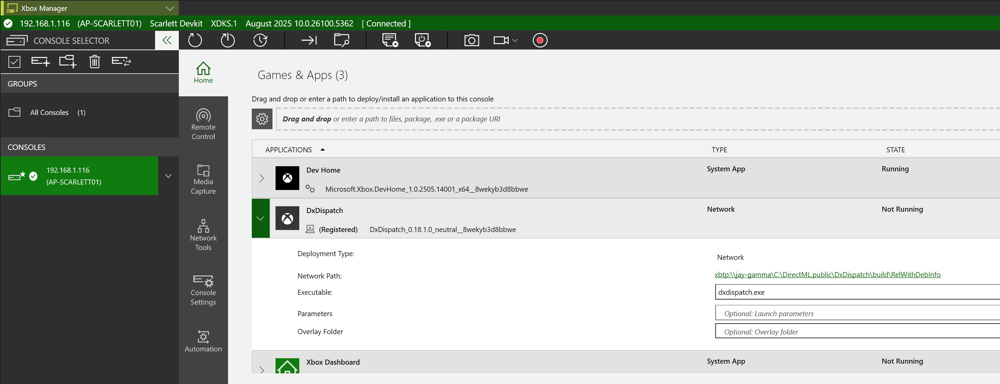
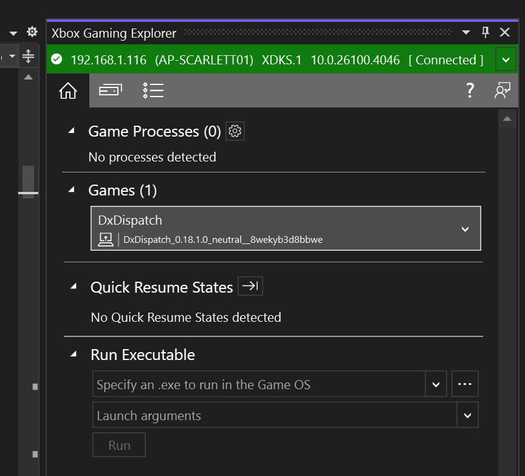
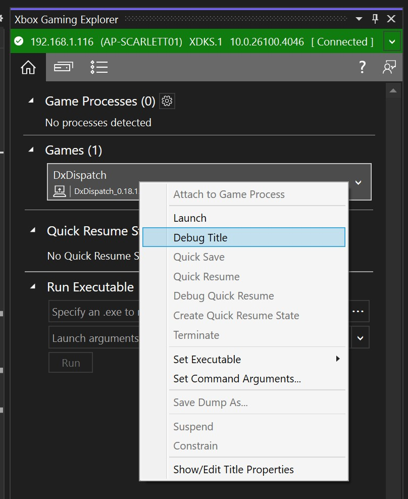

# DxDispatch

DxDispatch is simple command-line executable for launching DirectX 12 compute programs without writing all the C++ boilerplate. The input to the tool is a JSON model that defines resources, dispatchables (compute shaders, DirectML operators, ONNX models), and commands to execute. The model abstraction makes it easy to experiment, but it also preserves low-level control and flexibility.

Some of the things you can do with this tool:
- Launch [DirectML](https://github.com/Microsoft/directml) operators to understand how they work with different inputs.
- Run custom HLSL compute shaders that are compiled at runtime using the [DirectX Shader Compiler](https://github.com/Microsoft/DirectXShaderCompiler).
- Run ONNX models using ONNX Runtime with the DirectML execution provider.
- Debug binding and API usage issues. DxDispatch hooks into the Direct3D and DirectML debug layers and prints errors and warnings directly to the console; no need to attach a debugger.
- Experiment with performance by benchmarking dispatches.
- Take GPU or timing captures using [PIX on Windows](https://devblogs.microsoft.com/pix/download/). Labeled events and resources make it easy to correlate model objects to D3D objects.

This tool is *not* designed to be a general-purpose framework for building large computational models or running in production scenarios. The focus is on experimentation and learning!

# Getting Started

See the [guide](doc/Guide.md) for detailed usage instructions. The [models](./models) directory contains some simple examples to get started. For example, here's an example that invokes DML's reduction operator:

```
> dxdispatch.exe models/dml_reduce.json

Running on 'NVIDIA GeForce RTX 2070 SUPER'
Resource 'input': 1, 2, 3, 4, 5, 6, 7, 8, 9
Resource 'output': 6, 15, 24
```

# System Requirements

The exact system requirements vary depending on how you configure and run DxDispatch. The default builds rely on redistributable versions of DirectX components when possible, which provides the latest features to the widest range of systems. For default builds of DxDispatch you should consider the following as the minimum system requirements across the range of platforms:

- A DirectX 12 capable hardware device.
- Windows 10 November 2019 Update (Version 1909; Build 18363) or newer.
- If testing shaders that use Shader Model 6.6:
  - AMD: [Adrenalin 21.4.1 preview driver](https://www.amd.com/en/support/kb/release-notes/rn-rad-win-21-4-1-dx12-agility-sdk)
  - NVIDIA: drivers with version 466.11 or higher

# Building, Testing, and Installing

DxDispatch relies on several external dependencies that are downloaded when the project is configured. See [ThirdPartyNotices.txt](./ThirdPartyNotices.txt) for relevant license info.

Configure presets are listed configuration in [CMakePresets.json](CMakePresets.json):
```
> cmake --list-presets
Available configure presets:

  "win-x64"       - Windows x64
  "win-x86"       - Windows x86
  "win-arm64"     - Windows ARM64
  "xbox-scarlett" - Xbox Scarlett
  "linux-x64"     - Linux x64
```

To generate the project, provide one of the above names (e.g. `win-x64`) to cmake:
```
> cmake --preset <configure_preset_name>
```

You can build from the generated VS solution under `build\<configure_preset_name>\dxdispatch.sln`. 

Alternatively, build from the command line by using `--build` option and appending the build configuration to the preset name (e.g. the `win-x64` configure preset has the build presets named `win-x64-release` and `win-x64-debug`).

```
> cmake --build --preset <configure_preset_name>-(release|debug)
```

To run tests, change your working directory to the build folder and execute `ctest` (only supported on some platforms). You need to specify the build configuration (relwithdebinfo or debug) since the presets use VS, which is a multi-configuration generator:
```
> cd build\<configure_preset_name>

# Test release config
> ctest -C RelWithDebInfo .

# Test debug config
> ctest -C Debug .
```

# Build Configuration

DxDispatch tries to depend on pre-built redistributable versions of its external dependencies. However, the build can be configured to use alternative sources when desired or necessary. Each component can use one of the available (✅) sources in the table below, with the <b><u>default</u></b> selection for each platform listed first. Not all configurations are tested, and some platforms don't include the optional<sup>+</sup> components.

<table>
  <tr>
    <th>Preset</th>
    <th><a href="https://docs.microsoft.com/windows/ai/directml/dml-intro">DirectML</a></th>
    <th><a href="https://docs.microsoft.com/windows/win32/direct3d12/what-is-directx-12-">Direct3D 12</a></th>
    <th><a href="https://github.com/microsoft/DirectXShaderCompiler">DX Compiler</a><sup>+</sup></th>
    <th><a href="https://devblogs.microsoft.com/pix/winpixeventruntime/">PIX Event Runtime</a><sup>+</sup></th>
    <th><a href="https://onnxruntime.ai/">ONNX Runtime</a><sup>+</sup></th>
  </tr>
  <tr>
    <td>win-x64</td>
    <td><b>✅ <u>nuget</u></b><br>✅ winsdk<br>✅ local</td>
    <td><b>✅ <u>nuget</u></b><br>✅ winsdk</td>
    <td><b>✅ <u>archive</u></b></td>
    <td><b>✅ <u>nuget</u></b></td>
    <td><b>✅ <u>nuget</u></b></td>
  </tr>
  <tr>
    <td>win-x86</td>
    <td><b>✅ <u>nuget</u></b><br>✅ winsdk<br>✅ local</td>
    <td><b>✅ <u>nuget</u></b><br>✅ winsdk</td>
    <td>❌ none</td>
    <td>❌ none</td>
    <td><b>✅ <u>nuget</u></b></td>
  </tr>
  <tr>
    <td>win-arm64</td>
    <td><b>✅ <u>nuget</u></b><br>✅ winsdk<br>✅ local</td>
    <td><b>✅ <u>nuget</u></b><br>✅ winsdk</td>
    <td><b>✅ <u>archive</u></b></td>
    <td><b>✅ <u>nuget</u></b></td>
    <td><b>✅ <u>nuget</u></b></td>
  </tr>
  <tr>
    <td>linux-x64</td>
    <td><b>✅ <u>nuget</u></b><br>✅ local</td>
    <td><b>✅ <u>wsl</u></b></td>
    <td>❌ none</td>
    <td>❌ none</td>
    <td>❌ none</td>
  </tr>
  <tr>
    <td>xbox-scarlett</td>
    <td><b>✅ <u>nuget</u></b><br>✅ local</td>
    <td><b>✅ <u>gdk</u></b></td>
    <td><b>✅ <u>gdk</u></b></td>
    <td><b>✅ <u>gdk</u></b></td>
    <td><b>✅ <u>local</u></b></td>
  </tr>
</table>

Refer to the respective CMake files ([directml.cmake](cmake/directml.cmake), [d3d12.cmake](cmake/d3d12.cmake), [dxcompiler.cmake](cmake/dxcompiler.cmake), [pix.cmake](cmake/pix.cmake), [onnxruntime.cmake](cmake/onnxruntime.cmake)) for descriptions of the CMake cache variables that can be set to change the build configuration. CMake cache variables persist, so make sure to reconfigure or delete your build directory when changing variables.

# Custom Build for Xbox Scarlett

The custom build for Xbox Scarlett only support HLSL dispatchables, no DML ops, no ONNX model dispatchables. To configure the CMake build, do not use the preset `cmake --preset xbox-scarlett`, use the custom build configuration followed by the build commands as follows:

```
> cmake . -B build -A Gaming.Xbox.Scarlett.x64 -DDXD_ONNXRUNTIME_TYPE=none -DDXD_GDK_SYSTEM_EDITION=250401 -G "Visual Studio 17 2022"

> cmake --build build --config [Debug | Release | RelWithDebInfo]
```

The GDK Edition in this example is set to `250401` which indicates the *April 2025 Update 1* greensigned release of the Xbox GDK found at `\\edge-svcs\drops\greensignedpackages\2025_04_Update1__GDK`

### Properly Configure VS2022 with the Xbox GDK Extension
If you run into an error during the CMake pre-build steps, make sure to add **Game development with C++** component in VS 2022 installation, then reinstalling the GDK *after that VS installation/modification*, and that should fix it.

### Use RelWithDebInfo for Debugging
Currently, you won't be able to run the Debug build. This is due to the C-Runtime libraries populated by CMake `include(InstallRequiredSystemLibraries)` command does not include the Debug version (e.g. VCRUNTIME140d.dll, etc.) as they aren't shippable components. This is a bit unfortunate because by default the Release build does not include .PDB files, so you wouldn't be able to debug a Release build either. A solution to this issue is to use the `RelWithDebInfo` build, which is a Release build but with .PDB files populated in the build output directory.

## Set Up the Scarlett Dev Kit
Follow steps outlined in [this document](https://microsoft.visualstudio.com/WindowsAI/_git/dmldocs?path=/Xbox/Docs/devkit_setup.md&_a=preview) to configure a Scarlett devkit.

## Run/Debug DxDispatch with the Dev Kit
After the devkit is up and running, use the following commands to work with it.

```
> xbconnect

Connections at 192.168.1.116, client build 10.0.26100.4046:
       HOST: 10.0.26100.5362 (Host OS) @192.168.1.115
     SYSTEM: 10.0.26100.5362 (System OS) @192.168.1.116
      TITLE: Not running.

Default console set to "192.168.1.116" (192.168.1.116)
```

If the default console hasn't been set, run **Xbox Manager GDK** to set it up.


All the Xbox cmd tools *(xb\*.exe)* are under `\Program Files (x86)\Microsoft GDK\bin` directory, so adding this path as part of the user's path will allow it to be called elsewhere in the terminal or console, which is kinda handy.

Test if the Game OS is up and running in the devkit.
```
> xbapp querygameos

Game OS is not running.
Game is not running.
The operation completed successfully.
```
If it's not running, start it. Thanks to the DxDispatch build configuration, the matching version of the Game OS XVD is already there.
```
> xbapp applyconfig .\gameos.xvd

Game OS is starting up. Waiting for the OS to be ready for interaction...
The operation completed successfully.
```
The most convenient way to debug `dxdispatch.exe` running in the devkit is through VS2022 with the Xbox GDK Extension.

### Launch the App into Devkit
Unlike a typical Windows PC, a devkit can run a game in the Game OS only after the two conditions are met:
1. The game execution binary is uploaded and registered with the system.
2. The Game OS xvd is located in the same directory as the game execution binary.

The dxdispatch CMake script already populates the matching version of `gameos.xvd` in the build output directory alongside `dxdispatch.exe`.
```
> dir

    Directory: C:\DirectML.public\DxDispatch\build\RelWithDebInfo

Mode                 LastWriteTime         Length Name
----                 -------------         ------ ----
-a----         9/17/2025   3:53 PM          91136 dxdispatch.exe
-a----          6/6/2025   1:01 PM      345976832 gameos.xvd
                            ...

> xbapp launch .\dxdispatch.exe

  Launch string: .\dxdispatch.exe
The operation completed successfully.
```

With the `xbapp launch` command, the Xbox will start up the version of Game OS sitting next to your .exe and run the .exe inside that OS.

To check if the game is really registered after launched, do this:

```
> xbapp list

Registered Applications by Package Full Name:

   DxDispatch_0.18.1.0_neutral__8wekyb3d8bbwe
        DxDispatch_8wekyb3d8bbwe!Game
             xbtp:\\jay-gamma\C:\DirectML.public\DxDispatch\build\RelWithDebInfo\dxdispatch.exe
```

Note that the `xbapp launch` command will copy every file over to the Xbox storage, so if you have any additional test files to run with `dxdispatch.exe`, make sure they're all in the same directory before issuing the launch command. 

You can also see the registered apps in the Xbox Manager.



You will be able to see the registered app also show up in the "Xbox Gaming Explorer" pane in VS2022 (open from under Extensions/Xbox menu).



To start debug, select "Debug Title" menu option. Program's arguments and options e.g. `.\hlsl_add_fp32.json -i 2 -r 10 -v 2` can be supplied in the "Set Command Arguments..." option in the properties drop down menu.


